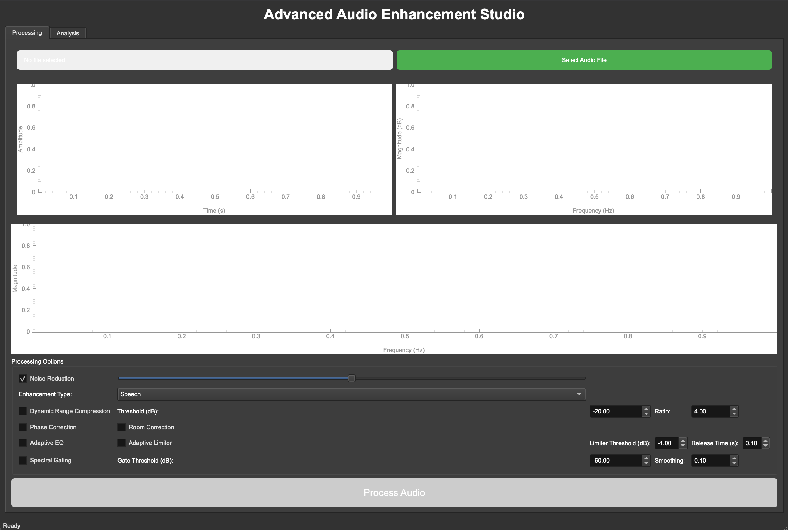

# SonicFocus — AI Hearing Assistant for Noisy Environments

SonicFocus is a desktop application designed to enhance and clarify audio in noisy environments using advanced AI and digital signal processing. With an intuitive PyQt6 interface and robust backend powered by PyTorch and Librosa, SonicFocus helps users reduce noise, enhance speech or music, and analyze audio signals in real time.

---

## 🚀 Features

- **Modern GUI:** Clean, user-friendly PyQt6 interface.
- **Noise Reduction:** Adaptive and spectral gating for background noise removal.
- **Dynamic Range Compression:** Adjustable settings for optimal clarity.
- **Audio Enhancement:** Specialized modes for speech, music, and general audio.
- **Spectral and Phase Correction:** Improve intelligibility and reduce artifacts.
- **Visualization:** Real-time waveform, spectrum, and spectrogram plots.
- **Batch Processing:** Enhance and save multiple audio files.
- **Flexible Export:** Save enhanced audio in various formats.

---

## 📸 Screenshots

**Main Window (No File Loaded):**

**Audio Loaded and Processed:**

---

## 🛠️ Getting Started

### 1. Clone the Repository

git clone https://github.com/mahimeh/SonicFocus---AI-Hearing-Assistant-for-Noisy-Environments.git
cd SonicFocus---AI-Hearing-Assistant-for-Noisy-Environments

### 2. Install Dependencies

pip install PyQt6 torch torchaudio numpy scipy soundfile librosa pyqtgraph

### 3. Run the App

python3 gui.py

---

## 📂 Project Structure

├── gui.py # Main GUI application (run this)
├── main.py # Command-line audio enhancer
├── advanced_processing.py # Core audio processing logic
├── README.md # Project documentation
└── (other supporting files)

---

## ⚙️ Usage

1. **Open the app** (`python3 gui.py`).
2. **Select an audio file** (WAV, MP3, OGG, FLAC).
3. **Choose enhancement options** (noise reduction, compression, etc.).
4. **Process and analyze** your audio.
5. **View visualizations** and export the enhanced result.

---

## 📝 Example Processing Options

- **Noise Reduction:** Toggle and adjust strength.
- **Enhancement Type:** Speech, Music, or General.
- **Dynamic Range Compression:** Set threshold and ratio.
- **Adaptive EQ:** Match target curves.
- **Limiter:** Prevent audio clipping.
- **Spectral Gating:** Remove persistent background noise.

---

## 👤 Credits

Developed by ADS Project Team 
Powered by PyQt6, PyTorch, Librosa, and PyQtGraph

---

## 📄 License

This project is licensed under the MIT License. See [LICENSE](LICENSE) for details.

